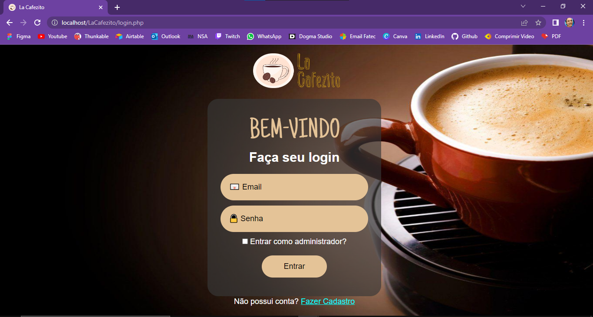
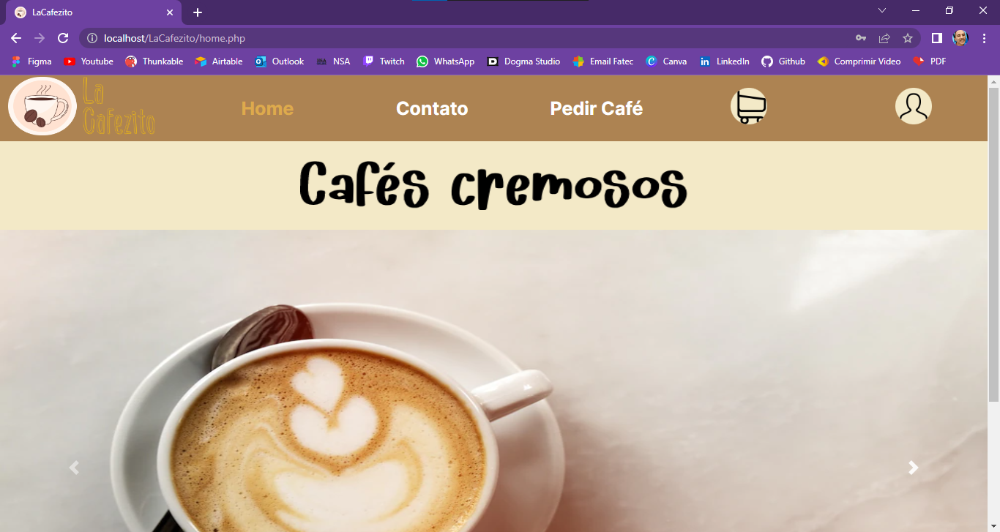
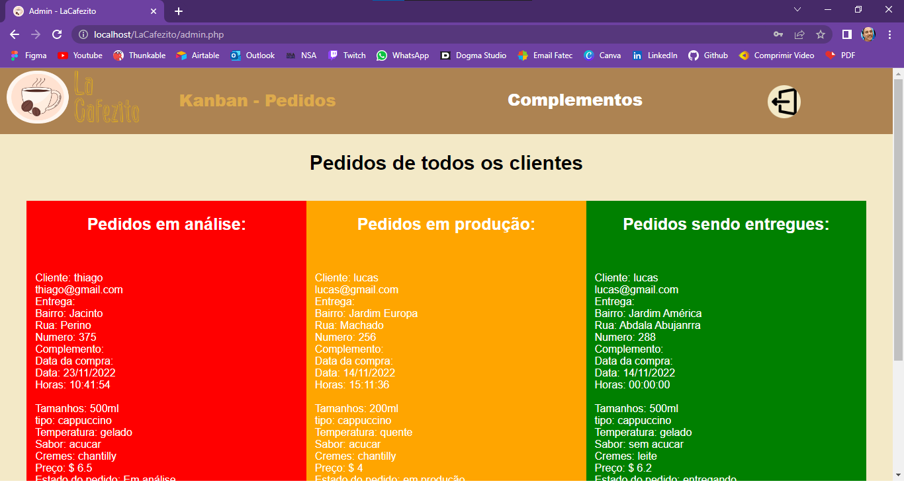
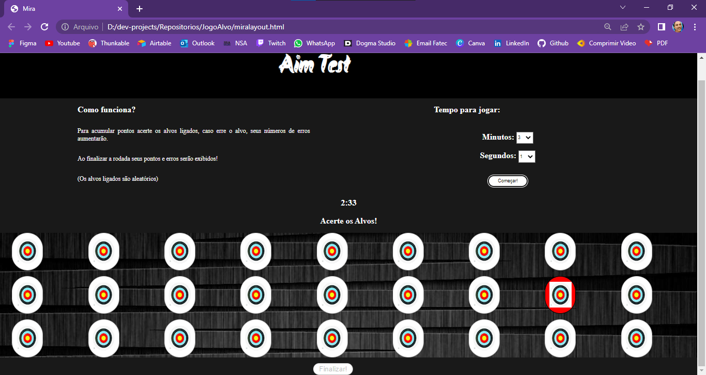

### Salve dev!
<body>

  <picture>
    <source 
      srcset="https://github-readme-stats.vercel.app/api?username=Lucas-Pontes-Soares&show_icons=true&theme=dark"
      media="(prefers-color-scheme: dark)"
    />
    <source
      srcset="https://github-readme-stats.vercel.app/api?username=Lucas-Pontes-Soares&show_icons=true"
      media="(prefers-color-scheme: light), (prefers-color-scheme: no-preference)"
    />
  
  </picture>
  

  <h1>Contato: </h1>
  <a href="https://www.linkedin.com/in/lucas-pontes-soares-88a211216/">LinkedIn: Lucas Pontes Soares</a>  
  <a href="emailto lucas.soares177@etec.sp.gov.br">Email: lucas.soares177@etec.sp.gov.br</a>
 

 

  <h1>Projetos: </h1>
  <h4>LaCafezito: </h4>
  
  
  
  <h4>Aim Test: </h4>
  

 
